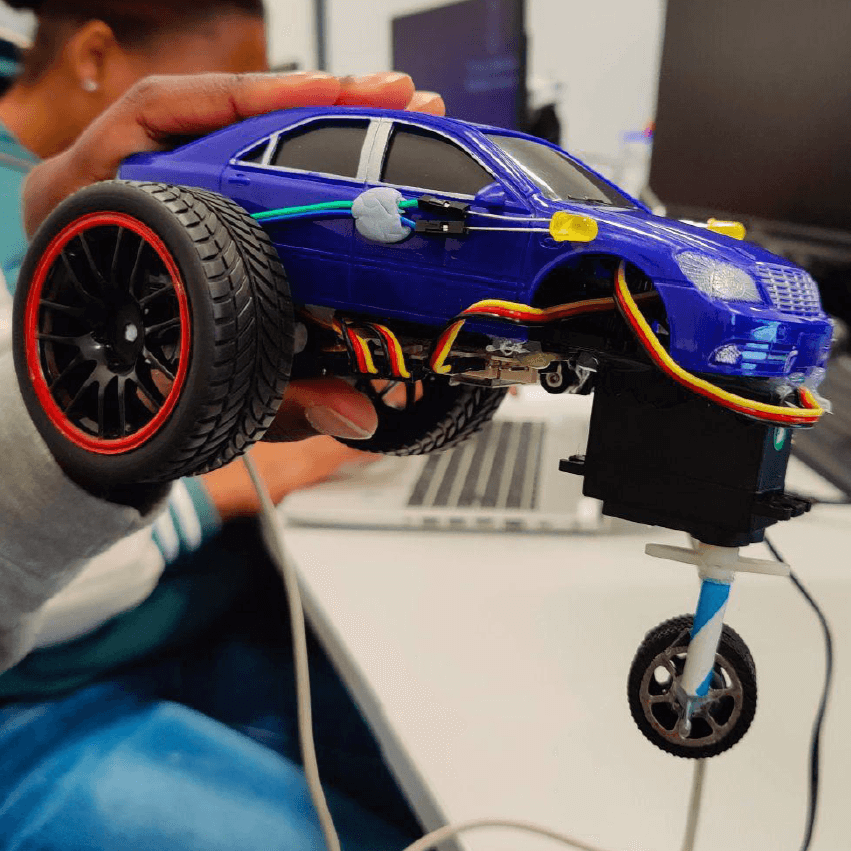
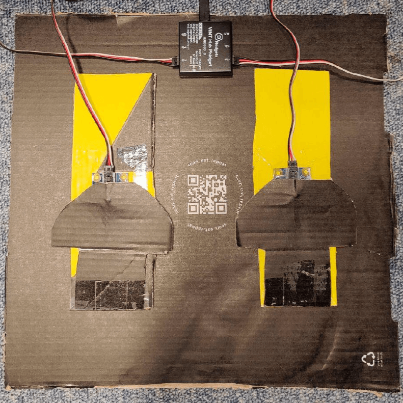
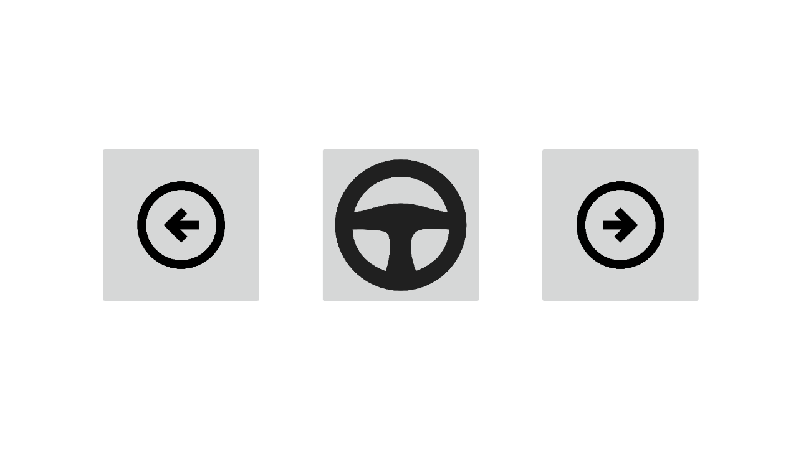

# Simulated Driving System

A smartphone-controlled, stationary vehicle system that replicates core driving interactions in a safe, controlled environment. It combines force sensors, embedded electronics, and mobile-based inputs to simulate steering, acceleration, braking, and signalling in real time.

## Related Resources

- 🚗 **Product Demo:** [Driving Simulation Demo](https://www.youtube.com/watch?v=GF5PHqHbHw8)
- 🌐 **Product-Level Walkthrough:** [dmmkimani.com/simulated-driving-system](https://dmmkimani.com/projects/simulated-driving-system)

## Project Context

This project was developed as part of a coursework module focused on interactive embedded systems and sensor-driven control architectures.

Rather than building a road-legal vehicle, the system was designed as a closed-loop human–machine interface that translates familiar driving actions, such as pedal pressure, steering input, and indicator signals, into responsive physical behaviour in a mechatronic prototype.

The objective was to recreate the core experience of driving in a controlled setting, enabling safe experimentation while removing real-world risk factors. This makes the system suitable for learning and demonstration of core driving capabilities.

## System Overview

The system consists of a stationary, suspended three-wheeled prototype controlled via a smartphone application and embedded force sensors.

   
  
  
   
  
   
   
  <em>(click to view full size)</em>

## Interaction Model

#### Steering

Phone orientation (roll and pitch) is captured via the accelerometer and mapped to a servo motor controlling wheel direction.

The system fuses orientation axes into a single steering signal to ensure stable control even during inconsistent device positioning.

#### Acceleration

A force sensor pedal detects applied pressure and triggers rear-wheel motor activation.

Motor output scales with how long the input is held rather than reacting to each individual trigger, producing smoother acceleration and deceleration.

#### Braking

A second force sensor pedal handles deceleration and stop behaviour.

Braking input overrides acceleration state, ensuring deterministic motor shutdown under conflicting inputs.

#### Signalling

Turn indicators are controlled via mobile UI inputs.

Each signal toggles a blinking state on the corresponding LED, with mutual exclusivity enforced (activating one signal disables the other).

#### Horn

A continuous press interaction triggers an audible horn signal through a speaker module, deactivated immediately on release.

## System Architecture

The system follows an event-driven architecture:

- **Mobile Layer:** Captures sensor and UI events (accelerometer, touch inputs, force sensor readings)
- **Control Layer**: Processes events and maintains system state
- **Actuation Layer**: Drives motors, LEDs, and speaker outputs

Background threads are used to manage continuous behaviours such as:

- motor persistence after input release
- LED blinking cycles
- real-time sensor polling loops

This allows the system to remain responsive without blocking input handling.

## Key Learning Outcomes

- Design of sensor-driven interaction systems
- Event-driven mobile-to-hardware communication
- State management for concurrent physical outputs
- Integration of heterogeneous input sources (mobile sensors + force sensors)
- Real-time control of electromechanical components

## Technology Stack

**Mobile:** Java (Android, Sensor APIs)
 
**Control Hub:** Raspberry Pi (GPIO-Based Actuator Control)
 
**Hardware:** Servo motor, Continuous Rotation Motors, Force Sensors, LEDs, Speaker
